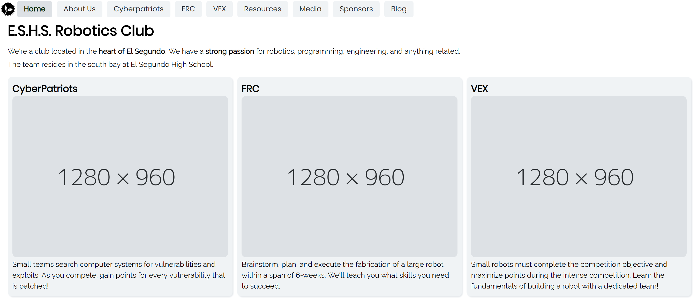
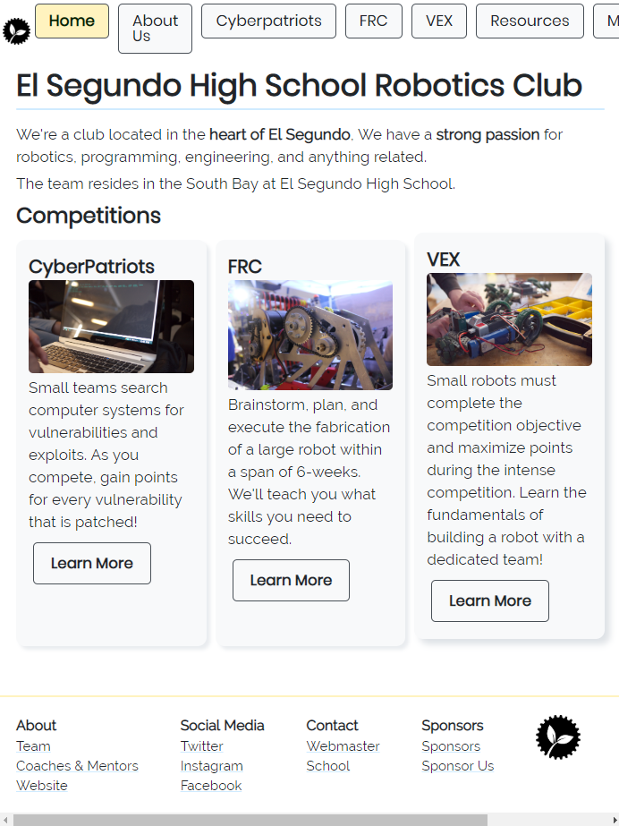
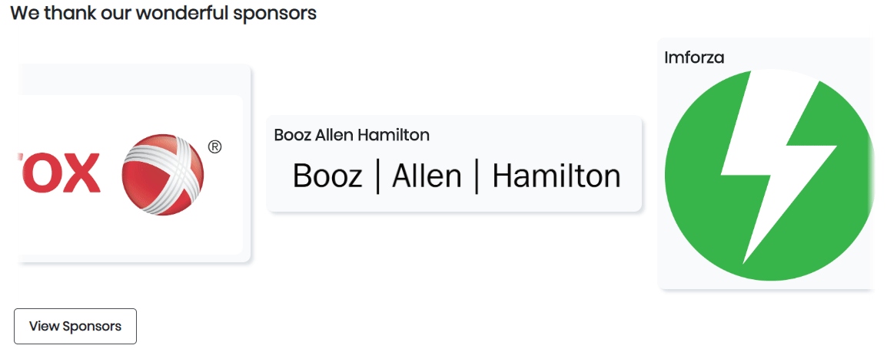

+++
title = "Making a Website for My Robotics Competition"
slug = "creating-website-for-robotics-club"
author = "Edwin Kofler"
date = 2019-04-09T21:23:47-07:00
categories = ["Web"]
tags = ["vue"]
draft = true
+++

During the November of 2018, I became aware of a [website](https://challenges.robotevents.com/challenge/95) competition. Students enrolled in a particular robotics program can submit a website for their robotics program by mid-January. Website creation tools (like ones from Wix or Weebly) were not prohibited. Winners are given gift cards, or something. After learning this, I thought this competition would be perfect to apply the frontend skills I learned the summer before. I knew I probably wasn't going to win, but I wanted to give it my best shot.

Around mid-november I created a new repository and started working. I made sure to use similar tooling / technologies that I had experience with, because I was still sort of new to web development. I used the [VueJS](https://vuejs.org) JavaScript framework. I remember feeling *ecstatic* because Vue-Cli-3 just released. Meaning, I didn't have to create my own Webpack config for Vue + Babel + Sass compiling / transpiling & HMR etc. Gosh, that was a nightmare with my first website.

# After a few days
Before making the first few commits, I remembered the significant lessons I learned from building my first website:

* Make components out of often-repeated "HTML"
* Do not make HTML templates large (split up into as many components as possible)
* Avoid creating large `.css`/`.sass` stylesheets (so large that they don't fit in their corresponding `.vue` component)

Keeping that in mind, I build a basic page showing what the layout will roughly look like. Nearly everything is grayscale because it helps me focus on the layout, rather than color-matching.
 
[See commit on GitHub](https://github.com/eshsrobotics/WebsiteChallenge2019/commit/6be6748794d08b85783afcfad2da3a96a132b5f8)

As you can see, I did not opt for any UI framework. I don't recall the exact reason, but I think I wanted to learn how to create good-looking components on my own. Even if this slowed down development, I enjoyed creating the components. Besides, it made the website look more unique. From my last website I learned that colors and icons can really make or break the look of a website. Nearly all of my colors derived from the great [Open Color](https://yeun.github.io/open-color) color pallette. Any svg icons you see are from [Feather Icons](https://feathericons.com).


# After a few weeks
After a few weeks, I realized the top-level architecture I had previously had to be modified. It looked something like this initially:
If you're not familiar, the `<router-view/>` component is different based on the current URL, such as `/home` or `/about`.

```html
<template>
  <div id="app">
    <navbar />
    <router-view />
    <foot />
  </div>
</template>
```

However, I opted to move the `page-heading` component out of `router-view`. This component consisted of the title of the page, and sub-pages of a route. Previously, I was duplicating the page heading across several components. This seemed wasteful at best, so I refractored to improve the structure.

```html
<template>
  <div id="app">
    <navbar />
    <page-heading />
    <router-view />
    <foot />
  </div>
</template>
```

After I revisted the structure, I had something like the following:

[See Commit on GitHub](https://github.com/eshsrobotics/WebsiteChallenge2019/commit/c231eee522374eb726cd54279bd5cf16c50be654)

Since the previous screenshot, I added an actual footer, better animations on the navigation tabs, and placeholder content.

# After a month or so
Unfortunately, our team's previous website had little content. On the plus side, I helped our team organize all our photographs in a single GitHub repository a few months before. So, I browsed the document tree and found some photographs.

After adding the images, I also added some colors. Our team colors are yellow and blue, so I styled accordingly.

[See Commit on GitHub](https://github.com/eshsrobotics/WebsiteChallenge2019/commit/899ae599e5d6d8eeb98bee49f42d0938ccce4681)

Although the desktop version of the site looked pretty good, the mobile version still needed a lot of work:

The nagivation bar overflowed the width of the screen and the cards showing the competitions have images too small.


# My favorite parts

## The sponsor carosel
I had the most fun making the carosel that displayed the club's sponsors. After imagining this effect, I found a [repository](https://github.com/biigpongsatorn/vue-infinite-slide-bar) that implemented this feature. For some reason, it didn't work at first, but cooperated when I put a set width on the component.



## Enlarge photograph page

I enjoyed animating the photograph card on hover. You can see it in the gif below: the card hover up, its shadow increases, and the "enlarge" icon fades in and slides to the left.

Creating the page that showed enlarged images was also enjoyable. At the time, I didn't know any best practices that allowed the image to stay on refresh. So, I just base64 encoded the data that described the image (among other data) in the URI. Because `/` is the last character in the base64 format, it created extra routes that were not intended. For that reason, all forward slashes were replaced with exclamation marks.

## Part with the most utility
The portion of the website with the most utility is the photo album. Earlier I said that I had to browse for photos directly through the GitHub interface. That was bothersome, as I had to click on each image to view it. I could have cloned the repository and searched for photos on my system, but I did not as I didn't want to find the photo on my computer, then find it on GitHub.


As I progressed, a put a lot of features on the roadmap. I planned to include a blogging system, an archive of photos, an archive of videos, and some membership login site. However, I quickly realized those were too many features on my platter. Eventually, I just settled for creating the photo library.

The photo library is probably my favorite feature, and probably the main reason any of the members will visit the website in the future.