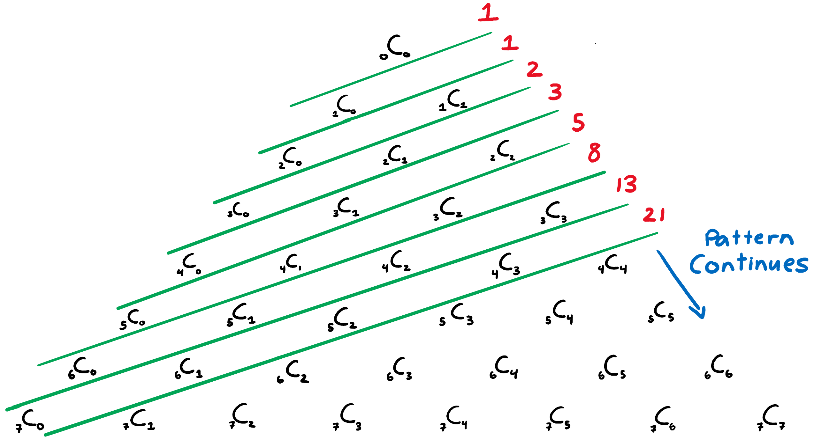
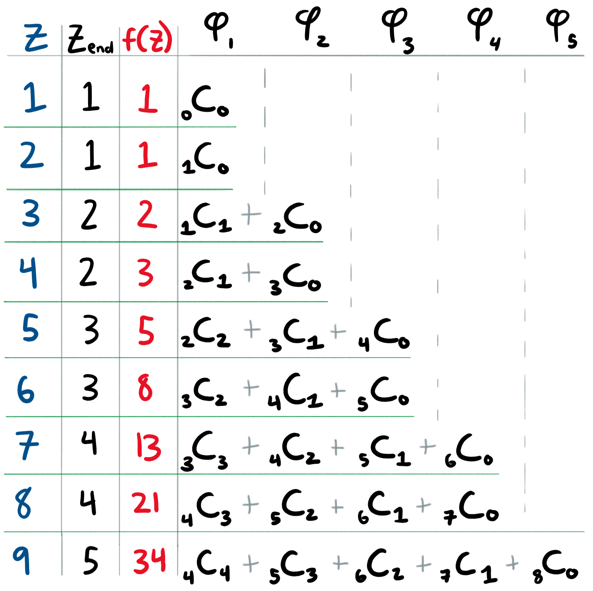
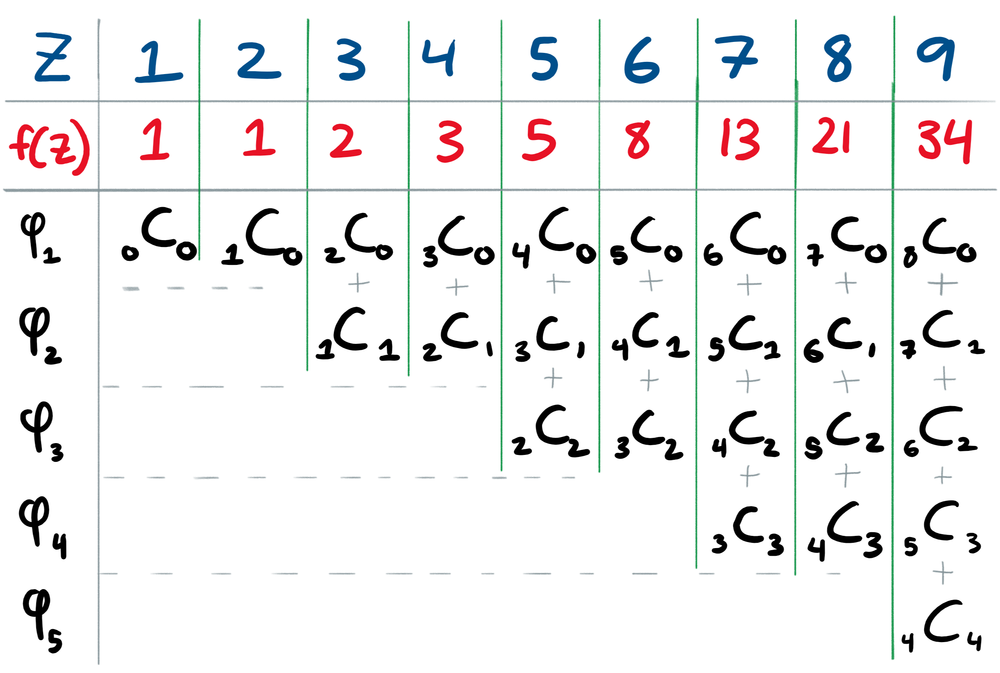

+++
title = "Fibonacci Equation for Zth (Nth) Term Using Pascal's Triangle (Part 2 of 2)"
slug = "fibonacci-equation-using-pascals-triangle-part-2"
author = "Edwin Kofler"
date = 2018-12-20T11:41:42-08:00
categories = ["Math"]
tags = ["pascal's triangle", "fibonacci"]
markup = "mmark"
katex = true
draft = false
+++

If you're not familiar with Pascal's Triangle, see [part 1](../blog/fibonacci-equation-using-pascals-triangle-part-1/).

# Finding a Formula

How do we leverage the relationship (in the image above) to obtain an equation that obtains the $$z$$th term ($$Fib(z)$$, or $$F(z)$$) in the Fibonacci sequence? First, we need to figure out what our equation may look like. We know we're adding up terms of the Fibonacci sequence, so a summation symbol will be used. Additionally, we are adding up terms from Pascal's triangle, where each term individually can be written as $$_nC_r$$.

So our final equation will look akin to this:

$$\sum_{\varphi=1}^{z_{end}}{_n}C_k$$

But this is not exactly right, since $$n$$ and $$k$$ are different for each $$\varphi$$th term that's being added up (dependent on the summation index). Therefore, we can more accurately write:

$$Fib(z) = f(z) =\ \sum_{\varphi=1}^{z_{end}}{_{n(\varphi)}}C_{k(\varphi)}$$

Note that the summation index, $$\varphi$$ is starting from $$1$$. Also, I'm starting Pascal's triangle from a row of 1. So since $$z$$ starts at 1, $$z_1 = 1$$, $$z_2 = 1$$, and $$z_3 = 2$$.

I started by reorganizing all the $$_nC_r$$ terms from the triangle above into rows. I tried to color the table similarly to the triangle.

One of the first and more obvious patterns is found in the $$z_{end}$$ column. Rather than increasing by an increment of $$1$$ for every row as the $$z$$ colum does, it increases by an increment of $$1$$ for every other row.

This is an important pattern because it determines the number of terms being summed.

$$z_{end} = round(\frac{z}{2})$$

Now, we know we can better describe what the summation might look like

$$Fib(z) = f(z) =\sum_{\varphi=1}^{round(\frac{z}{2})}{_{n(\varphi)}}C_{k(\varphi)}$$

So to find the $$4$$th term in the Fibonacci Sequence, or $$z = 4$$, we know $$z_{end} = 2$$. We're summing $$2$$ terms.

$$Fib(4) =\sum_{\varphi=1}^{2}{_{n(\varphi)}}C_{k(\varphi)} =\ _2C_1 +\ _3C_0$$

We only know that $$_2C_1$$ and $$_3C_0$$ are summed due to the table I wrote above. We don't know why $$n(1) = 2$$ or why $$k(2) = 0$$ yet.

There are a few other patterns held within the grid. I found it easier to find the pattern by changing which way the terms were summed. As you can see, I rearange the order of the $$_{n(\varphi)}C_{k(\varphi)}$$ terms, making the $$\varphi_1, \varphi_2, ...\ \varphi_{th}$$ terms somewhat arbitrary (depending on the grid structure rather than concrete values).

Now, you can see a clearer pattern for the $$k(\varphi)$$ more easily, now that they're more aligned. It's value is one less than the current summation index value (the $$\varphi$$th term, up to $$z_{end}$$).

$$k(\varphi) = \varphi - 1$$

Now, we just have to determine $$n(\varphi)$$. It's slightly harder because it depends on the $$z$$th term and the $$\varphi$$th term. In other words, it depends on the $$z$$th term we're adding to in the Fibonacci sequence and the value of the summation index, $$\varphi$$.

$$n(\varphi) = z - \varphi$$

Or, more accurately

$$n(\varphi, z) = z - \varphi$$

Now we have all of the missing parts! Putting it all together, we obtain

$$F(z) = Fib(z) = \sum_{\varphi=1}^{z_{end} = round(\frac{z}{2})}{_{n(\varphi,\ z)\ =\ z - \varphi}}C_{k(\varphi)\ =\ \varphi - 1}$$

Or, more succinctly

$$F(z) = \sum_{\varphi=1}^{round(\frac{z}{2})}{_{z - \varphi}}C_{\varphi - 1}$$

Does this equation give us the $$z$$th term of the Fibonacci sequence by adding up terms of Pascal's triangle? Yes! It conforms to the original goal.

Let $$z = 9$$. We obtain

$$F(9) = \sum_{\varphi=1}^{5}{_{9 - \varphi}}C_{\varphi - 1}$$

$$=\ _{9 - 1}C_{1 - 1} +
   \ _{9 - 2}C_{2 - 1} +
   \ _{9 - 3}C_{3 - 1} +
   \ _{9 - 4}C_{4 - 1} +
   \ _{9 - 5}C_{5 - 1} $$

$$=\ _{8}C_{0} +
\ _{7}C_{1} +
\ _{6}C_{2} +
\ _{5}C_{3} +
\ _{4}C_{4} $$

$$=\ 1 + 7 + 15 + 10 + 1$$

$$=\ 34$$

Did make a proof? No.
Although I can't conclusively say so, I do believe this works for any $$n\ |\ n \in \mathbb{N}$$.