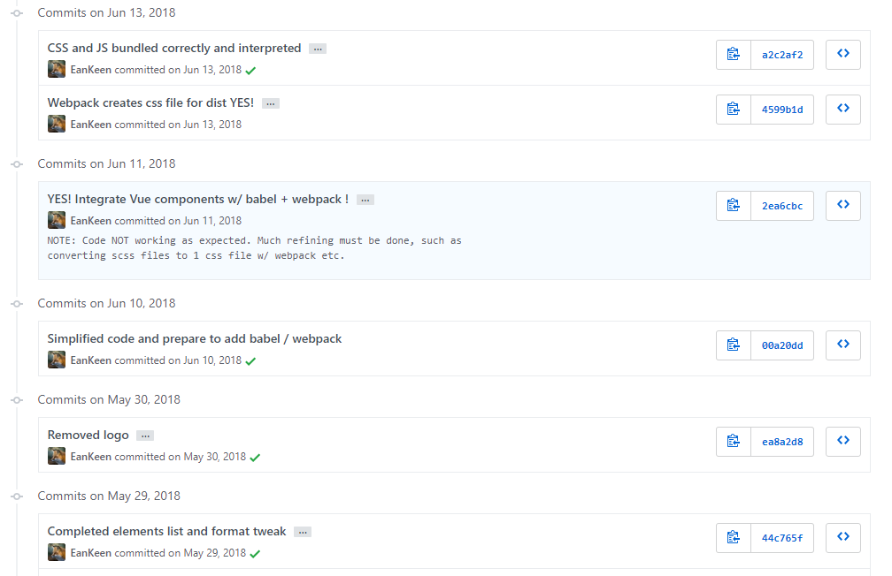
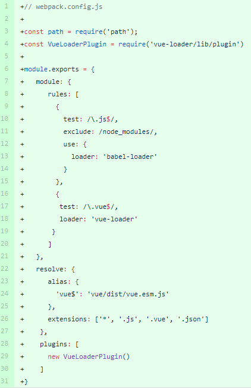

+++
title = "Web Development a Year Later"
slug = "web-development-a-year-later"
author = "Edwin Kofler"
date = 2019-04-27T07:23:39-07:00
categories = []
tags = []
draft = true
+++

So I was reintroduced to programming during the fall of 2017. I was learning Java in my AP Computer Science A class. The class was another one of those supposed "college-level" "advanced placement" classes, which actually became really fun near the end. You see, I was finishing up a really fun [final project](https://github.com/EanKeen/word-finder) (written in Java). It was basically an anagram finder, with a few extra features (including local multiplayer).

Because it was so fun, I wanted to create a larger programming project. Some project that people can look at without downloading anything. Naturally, I realized the web was perfect for this. No need to download anything - people can see your program just by opening up a link!

My first project idea was a flashcard application that I wanted to look as good as [Quizlet](https://quizlet.com), but had as much functionality as [Anki](https://apps.ankiweb.net). So I began to create a mockup.


Keep in mind, the only other program I created at this point is a terminal-based [anagram finder](https://github.com/EanKeen/word-finder). It's somewhat silly brainstorming a more complex project in retrospect, but I believed it helped motivate me.

While brainstorming, I realized that I had to figure out which technologies to leverage to build this app. I had experience building a few applications with Java Swing. However, I thought building things with Java Swing was klunky. I researched alternatives and came across [Electron](https://electronjs.org). In a nutshell, you create your application with HTML/CSS/JS and it wraps your whole application in an instance of Chromium. I thought it was perfect because I had some experience with web technologies 5 years prior (at the time I didn't get interested in it).

## Baeuda
I didn't have any JavaScript experience whatsoever. Was it a mistake? No, but it was kind of funny looking back. || There were some amazing tutorial series online that helped me get started. I recall having to learn and familiarize myself with a bunch of technologies (and the terms that came with it): node, electron, npm, you get the idea. All that beginner stuff.

Everything was super foreign to me because I didn't know JavaScript. Think of it as learning how to cook on an alien planet. Except, there are no similarities whatsoever. I was worried about breaking the whole project if I changed a few lines. Luckily, I used Git for version controlling and knew I could rollback any changes if I needed to.

After a few weeks, I was able to create a lame sidebar menu. Huzzah! I can do web development.

At that point I realized that I needed to learn more before talking this huge "flashcard project". I chose to work on a much smaller project that would give me experience to work on the bigger project.

## Sigag
I called this smaller project [Sigag](https://github.com/EanKeen/sigag). It means "time" in Korean. Basically I wanted to create the standard pomodoro timer with the same technologies used to create [Baeuda](##baeuda). So this time creating the project was a bit easier since I created a project with Electron (and npm) previously.

And it was this time I learned more about how to design an User Interface. Not really the technical details behind a user interface, but that "feel" you get when making one.


You can see that a lot of the design changed over time. Not just the colors, but the shape and position of the text, buttons, and sliders. Naturally, I observed other sites, and mimicked the parts I liked most. Eventually, I opted to remove most color, since I couldn't find any good color combinations. It could look better, but the improvements over each iteration is noticeable.

Before I was even able to finish a MVP for the Sigag application, my attention drifted to another application idea.

You see, I took chemistry the summer before and used [Ptable](https://ptable.com) to look up information about each element. However, the current design (at the time) was created in the mid-to-late 2000s. So mobile and tablet support was near zero. And for me personally, the UI (and UX) was less than thrilling. I extrapolated the UI on my Sigag timer and imagined how it would look if it was some periodic table. That's when I imagined my gorgeous periodic table user interface.

The new interface alone would cause people to use this hypothetical periodic table website. However, I wanted to differentiate my product further. I brainstormed a large list of potential features.

After I figures out how my website should look, I began to research tools to build it.

That's when I started to die a bit inside. It's kind of hard to explain what it was like researching the JavaScript tooling ecosystem. As a beginner, it was like reading English, minus the conjunctions and articles.

So take any of these terms

```
RequireJS, CommonJS, AMD, UMD, ESM, Node, Express, Koa, Electron, EJS, AngularJS, Angular2+, React, Vue, Browserify, Grunt, Gulp, Webpack, Rollup, Typescript, CoffeeScript, Dart, ES2015, ES6, Babel, jQuery, npm, yarn, Sass, Less, Stylus, PostCSS
```

And describe the purpose of each one in two or three words, without using any technical terms. What you get is a super hazy high-level "explanation".

```
Browserify lets you require('modules') in the browser by bundling up all your dependencies

Webpack is a static module bundler for modern JavaScript applications.

Gulp is a toolkit for automating painful or time-consuming tasks in your development workflow, so you can stop messing around and build something.

CommonJS defines a module format. ...there are CommonJS spec proposals for Transport formats and an asynchronous require.
```
^ How would people with little experience programming interpret that?

Anyways, in the midst of this, I chose (what I believe now to be) the right options. I chose VueJS as a JavaScript framework, bundled my crap with Webpack, styled up my components with Sass, and of course used Babel to transpile my JS.

Anyways, after I chose my tools, I realized that it would be difficult to set everything up all at once. Besides, it would be easier to introduce one tool at a time so I can understand why they were needed.

So (on May 13) I just created an HTML file and worked on my app, using the VueJS CDN. What's great is that my text editor (Atom at the time) had plugins. I used a SASS plugin that compiled Sass down to Css and some HTML preview page (that live updated).

About a month later I kept on adding to that HTML file until it grew to a near 100 line monstrosity. Also, I was adding a bunch of `script` tags near the end (in addition to a `main.vue` file, which was really just a plain JS file). That was the time I decided to use Webpack. Plus, my school was basically finished so I had much more free time on my hands.

:weary: I think I'll have to say that was the most painful moment in my life, trying to use Webpack for the first time. :weary:

I'm not even joking, I think I almost died.



I don't even remember how many times I tried to get Webpack to work. I'm laughing (and dying) a bit inside just thinking about what was going on during that week. I had near-daily commits since May 30, and that week or so of "nothing" was me just trying to get Webpack to work. (that `00a20dd` commit was probably me starting from scratch again). I remember thinking if I should use Webpack without Babel, or just Babel without Webpack, but I decided not to, since many tutorials combined them.

The final config? It looked like this



It's deceivingly simple, just because that one's correct :joy:
I wish I could see all the ones that I thought would work, but didn't.

Anyways, I also used Webpack to compile my Scss into Css, which was much easier.

Another month passed by (July 13)

At first I began to dread using Webpack, because now I had to use loaders for my svg, font files, and similar. But later I accepted the challenge and realized it's use. This was when I was using `webpack-merge` to create separate development and production builds. Integrating UglifyJS, MiniCssExtractPlugins, OptimizeCssAssetsPlugin, CopyWebpackPlugin, etc. wasn't so bad. I remember failing to export separate chunks (which would be lazily-loaded as I changed routes) with Webpack. I didn't mind missing out on that feature so much.

As July turned to August, I basically started to refine most of my application. This was when I started harvesting data about the elements of the periodic table. I had to write some scripts in the Wolfram Language to get data about each element. I exported much of the data as one large JSON. I used Gulp to transform the bundle and move stuff to the backend (which I also recently created).

It was around this time I became sort of close to burning out. You see, when school started I poured all my available free time into building this application. At first, I was working maybe 6 hours a day, but that quickly grew to 10, then 14. The few weeks I was working 18 hours a day on the application took a huge toll. I could have gotten so much more done if I was not sleep deprived. 🤔 I took a few days break after that to prevent myself from burning out. A few other sporadic breaks helped keep my sanity.

I originally planned to finish the application before school started, but I realized that really was not going to happen during September. I wanted to release my application as a birthday present, but I ended up pushing a half-baked application that didn't really work. It didn't even have any data.

It basically looked something like this


All the styling was how I wanted, but I just wasn't sure how to manipulate the data in a way which would be maintainable. Now that I reflect, I was thinking too hard about it. I should have just built something. Since I had no experience building any other website, that was the best course of action.

Eventually, Vue Cli 3 came out, which basically automatically created a Webpack config which transformed Vue, JS, Css, etc. all files for you. That's when I decided to rewrite everything from scratch. Since I learned a lot about Vue in the summer I used it, it would be good anyways, it would make the codebase more maintainable.

